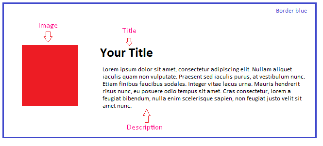

# Coding Challenge - 001 : CSS Blog 

Purpose of the this coding challenge is to write a code that make a CSS Blog.

## Learning Outcomes

At the end of the this coding challenge, students will be able to;

- analyze a problem, identify and apply coding knowledge for appropriate solution.

- demonstrate their knowledge of algorithmic design principles by using function effectively.

   
## Problem Statement

- Write a code that creates a css blog.

* Functionally similar to this: [CSS Blog](https://codepen.io/AaronClarusway/full/LYNWayo)

- If you see the pic above, you will see 1 image , 1 title and 1 description inside one div with a blue border.
