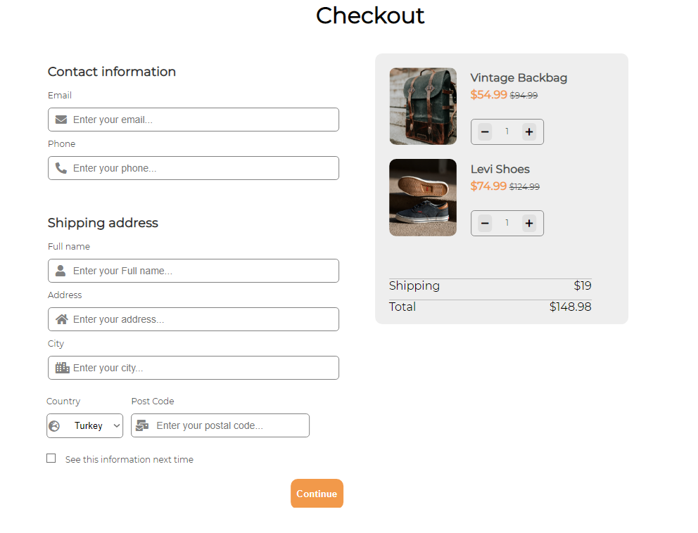

# Coding Challenge - 003 : Checkout Form

Purpose of the this coding challenge is to write a code that make a checkout form.

## Learning Outcomes

At the end of the this coding challenge, students will be able to;

- analyze a problem, identify and apply programming knowledge for appropriate solution.

- demonstrate their knowledge of algorithmic design principles by using function effectively.

   
## Problem Statement

- Write a code that creates a checkout form.

- Create a checkout page following the design.

* Functionally similar to this: [Form](https://aaron-clarusway.github.io/form/)

-  User story;

   - I can input email, phone, full name, address, city, country, and postal code

   - I can select at least 3 countries from the dropdown

   - When I click submit button or press enter, I can see a warning if validation fails

   - When I click submit button or press enter, I can see a successful alert if validation succeeds

🔥 You don’t need to use JS in this challenge but use correct input types and validation 

## Resources

- [Images]("./IMG")

- [Fonts]("./FONTS")