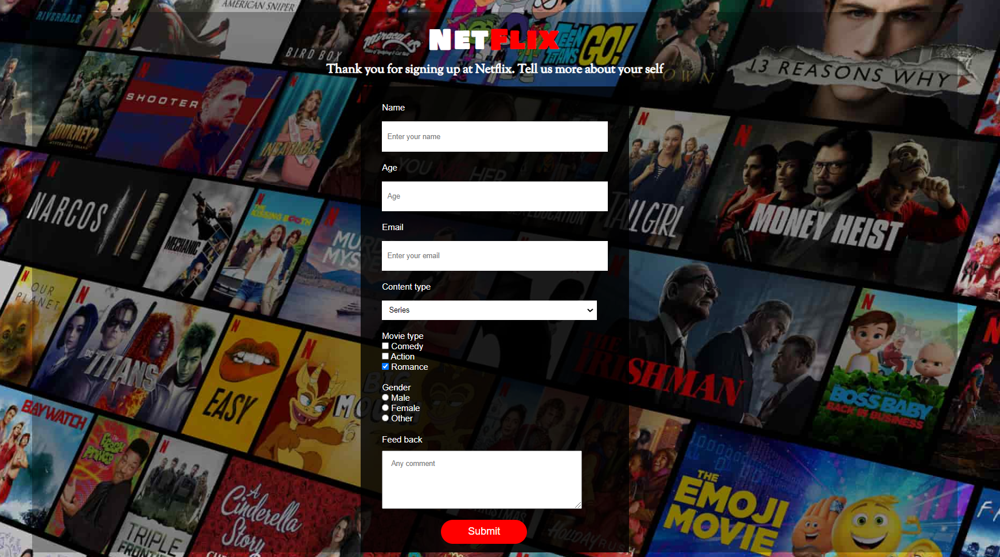

# Project-001 :Survey Form (HC-01)

## Description
Project aims to create survey form within html and css.

## Problem Statement

- Your company has recently started on a project that aims to conduct a survey to measure the demands and interests of its customers. So you and your colleagues have started to work on the project.

## Project Skeleton 

```
001-survey-form (folder)
|
|----readme.md         # Given to the students (Definition of the project)          
|----solution
        |----index.html  
        |----style.css   
        |----result.html 
```

## Expected Outcome



## Objective

Build a Survey Form that is functionally similar to this: [Survey Form](https://mccarthy-silva.github.io/Survey-Form/)

### At the end of the project, following topics are to be covered;

- HTML Forms-Input Types 

- HTML Form Elements

- CSS Colors-Border Properties

- CSS Margins-Padding

- CSS Properties for Texts-Font Families-Links


### At the end of the project, students will be able to;

- improve coding skills within HTML & CSS

- use git commands (push, pull, commit, add etc.) and Github as Version Control System.

## Steps to Solution
  
- Step 1: Download or clone project repo on Github 

- Step 2: Create project folder for local public repo on your pc

- Step 3: Create Survey Form

>>Part-1 HTML Structure

	- Creat structure of the HTML5
	- Give name of your project (title)
	- Create the main structure of the container (div id="container")
	- Create Main Topic of the project (id="title")
	- Create a description of your project (id="description")
	- Create a form (id="survey-form")
	- Create 4 divisions (class="box") for each label and single-line text input field (Tips:Don't forget to use placeholder)
	- Create a division (class="box") for a dropdown list. (Tips:dont forget to use a label tag)
	- Create a division (class="box") for checkbox list
	- Create a division (class="box") for radio buttons
	- Create a division (class="box") for a multi-line input field (Tips: a text area)
	- Create a button for id="submit" the form

>>Part-2 CSS Structure

	- Set a background and define font-color="white"
	- Set container background color and margin
	- Define "title" and "description" color-size-padding etc...
	- Define "survey-form" color-size-padding etc..
	- Define labels color-size-padding etc... (Tips: id="name", "email", "number" ...)
	- Set class color-size-padding-margin etc...
	- Define id="submit" color-size-padding etc...
	
- Step 4: Push your application into your own public repo on Github

- Step 5: Deploy your application on Github template to showcase your app within your team.

## Notes

- You can use HTML,and CSS to complete this project.

## Resources

-  [Background Image Url](https://assets.nflxext.com/ffe/siteui/vlv3/998c1c50-6aaa-4795-ab62-9190a025d529/b9883521-f439-4c16-b5eb-b1719e2fece1/ZA-en-20191203-popsignuptwoweeks-perspective_alpha_website_small.jpg)


## Happy coding!

